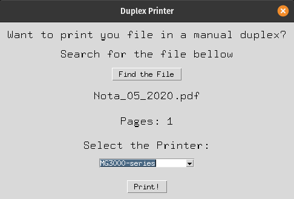
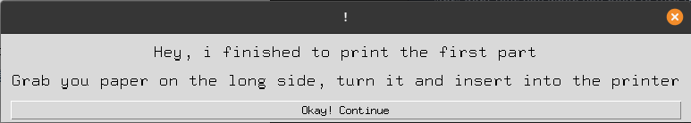

# PyPrinter

PyPrint is a easy way to print duplex (both sides) on printers that only supports simplex printing.

This project was made because my Pixma MG3010 was unable to use duplex mode in my linux distro, so to avoid the boring process to "write only odds pages > print > write only evens pages > print", i decided to make this simple application.

## Why you don't just use LPR commands?
"lpr" dont tells you when you need to turn the paper, it just print continuously, in this application you need to confirm you turned the paper to continue printing.

## GUI application






## Installation

If you want to run the linux executable skip this step, otherwise, To run the python script you may need:

```bash
pip install -r requirements.txt
```

## Usage

There's two ways:

- If you are using linux distro, just run the executable inside [dist folder](dist)

- If you are a windows user, or you want to contribute to the project, you will need to run the following:

```bash
python printer.py
```

## Contributing
Pull requests are welcome. For major changes, please open an issue first to discuss what you would like to change.

## License
[MIT](https://choosealicense.com/licenses/mit/)
